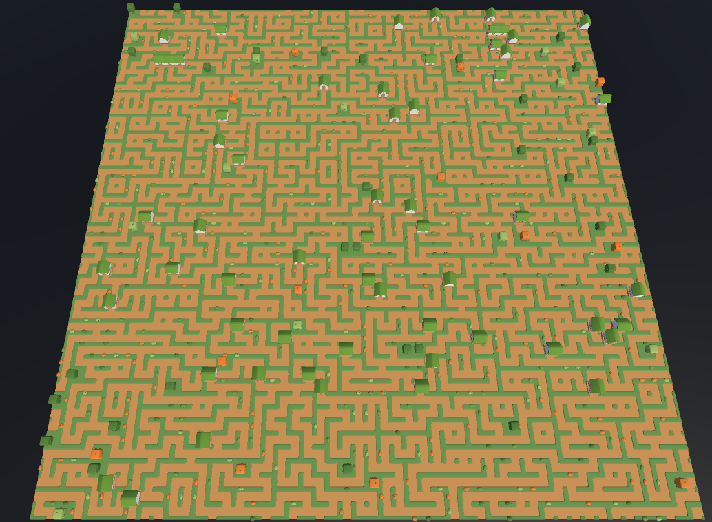
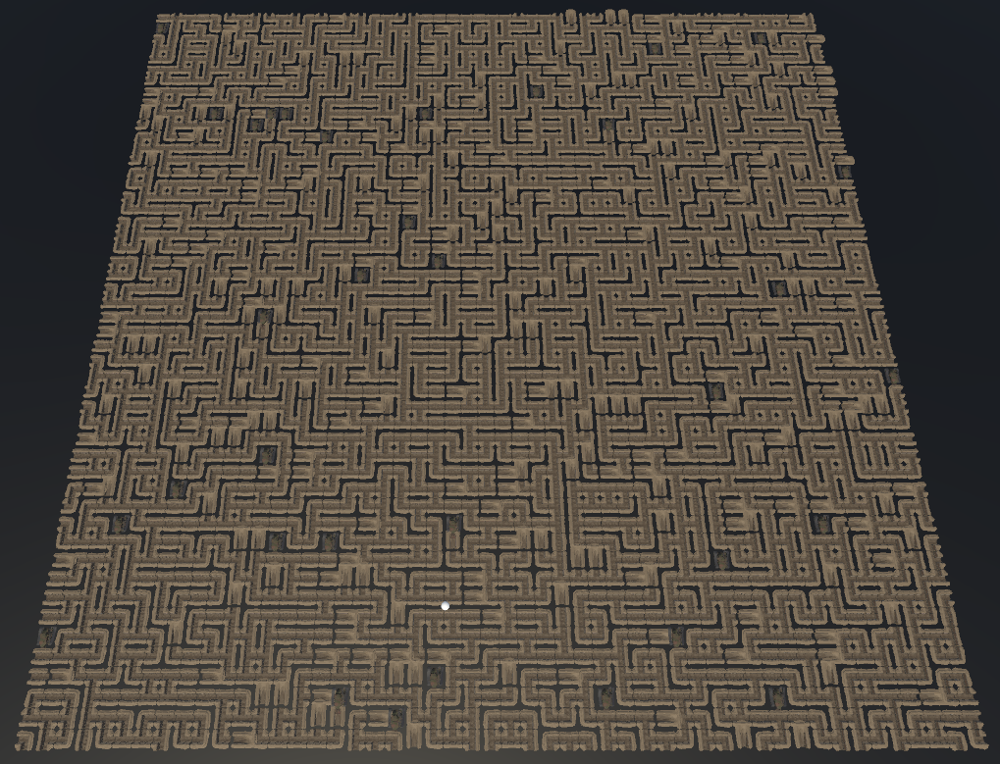

# Implementation and Analysis of the Wave Function Collapse (WFC) Algorithm in Unity

## Summary

This thesis focuses on the implementation and analysis of the Wave Function Collapse (WFC) algorithm in the Unity environment using C#. The aim of the project is to create a custom version of the algorithm capable of generating unlimited, two-dimensional grids based on prefabs, allowing for easy adaptation and modifications.

The algorithm has been integrated with a dynamic world generation mechanism that responds to player movements, enabling the creation of a smooth and continuous gameplay experience. The thesis also includes an analysis of the algorithm's performance, considering the generation time of individual grid elements and managing their state in the context of average frame duration and system response to changes. This provides a foundation for further development and optimization of the algorithm.

This work was created as part of an engineering thesis for computer science studies at the University of Zielona Góra. The original idea of the Wave Function Collapse algorithm was proposed by [Maxim Gumin](https://github.com/mxgmn/WaveFunctionCollapse).

## Preview

### Generation N = 10 

### Generation N = 50

### Complex Maze Generation

